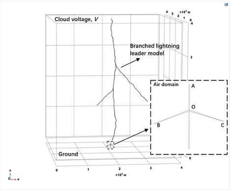

------
## A Backward Approximate Dynamic Programming Model for Closed-Loop Supply Chain Network Design
*University of Southern California, Dec. 2023 ~ Now*  
*Advisor*:  [Prof. Maged Dessouky](https://viterbi.usc.edu/directory/faculty/Dessouky/Maged)

Large-scale adoption of electric vehicles (EVs) can reduce greenhouse gas emissions and improve air quality. Nonetheless, a significant amount of EV batteries are expected to retire within five years, posing environmental and economic challenges regarding management and disposal. Implementing a closed-loop supply chain (CLSC) network is a promising strategy. The core idea is to enhance battery utilization and reuse valuable resources. In this work, we develop a joint optimization framework for the CLSC network design and operations problem where two levels of decisions in different time resolutions are periodically optimized. At the upper level, we formulate a backward dynamic programming model to design a capacity expansion and facility-building policy for the CLSC to cope with the uncertainties from markets and politics. At the lower level, we formulate a stochastic multi-stage stochastic programming model to optimize the daily operations of the CLSC and maximize the overall revenue under demand and supply uncertainties. Lastly, we use real-world datasets to validate the model and demonstrate the solution approach. 

 

## Multi-Agent Reinforcement Learning for Dynamic EV-Sharing Relocation
*University of Southern California, Dec. 2023 ~ Now*
*Advisor*:  [Prof. Maged Dessouky](https://viterbi.usc.edu/directory/faculty/Dessouky/Maged)

We study the dynamic relocation problem of an electric vehicle (EV) sharing system that provides on-demand mobility service. Our research aims to obtain a high-quality real-time relocation strategy for a widely distributed large-scale shared EV network to cope with stochastic demand and computational challenges due to the curse of dimensionality. Specifically, we propose a decentralized two-stage decision-making scheme. In the first stage, we develop a multi-agent reinforcement learning framework that treats each EV-gathering station as an agent to determine its relocation requests. In the second stage, we transform the individual relocation requests into a feasible relocation strategy that satisfies system-wide constraints, like fleet conservation, by solving an auxiliary optimization problem. Lastly, we evaluate our method by comparing it with several optimization-based and learning-based approaches in terms of solution quality and efficiency based on real-world data. 

## A Learn-Based Approach for Order-Pooling and Order-Dispatching in a Large-Scale Ride-Sharing System
*Columbia University, Jun. 2021 ~ Dec. 2021*  
*Advisor*:  [Prof. Sharon Di](https://www.civil.columbia.edu/faculty/sharon-di)

In this work, we work on designing a centralized management strategy for the
online platform to solve the two-phase dynamic ride-sharing matching
problem (TDRMP). In the first phase, given the information of existing
trip requests, the platform decides whether to combine any two individual
trip requests into a shared ride. In the second phase, the platform
assigns both the shared rides and the unmatched trip requests to idle
drivers. We proposed a learning-based approach that integrated a graph neural network model into a local search algorithm to optimize the matching policy in an online ride-hailing system. We designed a training method combining imitation learning and evolutionary strategy, where the model was trained to imitate traditional algorithms and then evolve through interactions with the environment.

 ([source](https://arxiv.org/pdf/1912.08066.pdf))

## Energy-Sponge Electric Vehicle Sharing System Design
*University of Wisconsin-Madison, May 2019 ~ Jan. 2021*  
*Advisor*:  [Prof. Xin Wang](https://directory.engr.wisc.edu/ie/Faculty/Wang_Xin/)  
Collaborator: Yikang Hua  

Rather than traditional vehicle sharing, a shared Electric Vehicle (EV) fleet creates beneficial connections between the transportation and power grid systems. A large-scale shared EV fleet can serve as a huge battery. It stores redundant energy during non-rush hours, releases them to satisfy the need for transportation, and serves as a backup for the power grid, forming a so-called “energy sponge” service. While such an “energy sponge” service aims to mitigate demand disturbances and improve system resilience, its implementation faces several critical challenges due to the power grid regulations and the complexity of vehicle management. In light of this, our work establishes a profit-driven planning framework to enable the coordination of transportation needs and power grid backup services. Optimal management strategies for the EV sharing system are developed incorporating the day-ahead energy and regulation markets. In particular, we build a two-stage stochastic model to generate management strategies, where the bid process of an EV fleet operator in the day-ahead energy and regulation markets constitutes the first stage, and the next-day operations of the EV fleet are the second stage, considering the stochastic spatiotemporal fluctuations of car-sharing orders. The model is solved via Sample Average Approximation method. Interesting managerial insights on bid strategies are obtained through a case study in Austin, Texas, US.

## Design Optimization of Composite Wind Turbine Blades
*Zhejiang University, Sept. 2018 ~ Apr. 2019*  
*Advisor*:  [Prof. Weifei Hu](https://person.zju.edu.cn/en/0018087/)

This article presents a design optimization framework which integrates realistic lightning strike electrostatic and fatigue analyses for designing reliable and economical composite wind turbine blades. The novel aspects of this work include: a parametric tortuous lightning stepped leader model that reflects one of the true natural characteristics of the lightning phenomenon; and characterization of both the lightning strike dielectric breakdown failure and multi-axial fatigue failure mechanisms for structural design of composite wind turbine blades. A case study of the structural design optimization of a 5 MW composite wind turbine blade is tested using the framework with two optimization solvers: sequential quadratic programming (SQP) and Bayesian optimization (BO). SQP produces a superior optimal design to BO. In the optimum blade design based on the SQP algorithm, the lightning safety ratio increased by 32% and the expected fatigue life increased more than 15 times compared with the initial blade design.

<figure class="half">
  
  
</figure>
